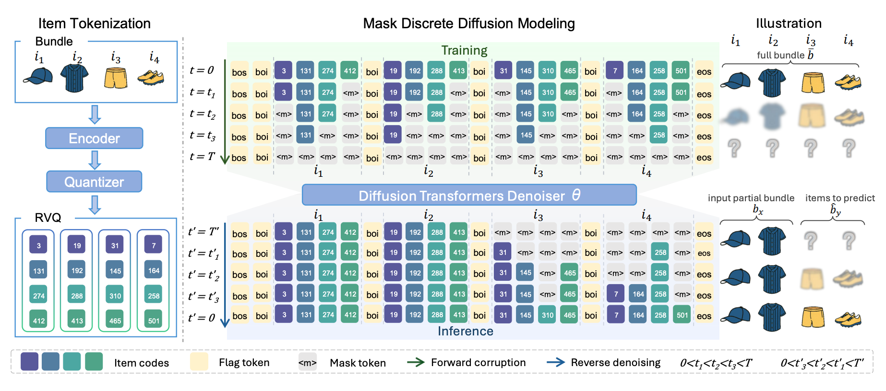

# Discrete Diffusion For Bundle Construction

Teng Tu, Ai Li, Yunshan Ma, Shuo Xu, Xiaohao Liu, Haokai Ma, Liang Pang and Tat-Seng Chua



## Introduction

**DDBC** is a method for constructing product bundles from large item catalogs. Unlike sequential models, it treats bundles as **sets** and captures **higher-order item relations** using a **masked denoising discrete diffusion model**.  

Key features:  
- **Non-sequential bundle construction** for flexible item selection.  
- **Vector-quantized discrete space** (RVQ) to reduce the search space.  
- **Masked denoising training** for modeling partial bundles and joint item distributions.  


## Environment Requirements

- Python: 3.9.21
- PyTorch: 2.2.0+cu121
- Other dependencies: listed in `requirements.txt`

### Setup Environment

```bash
conda create -n DDBC python=3.9.21
conda activate DDBC
```

```bash
python -m pip install torch==2.2.0 torchvision==0.17.0 torchaudio==2.2.0 --index-url https://download.pytorch.org/whl/cu121
```

```bash
pip install -r requirements.txt
```

### datasets

the dataset we used is from xhLiu/BundleConstruction(https://huggingface.co/datasets/xhLiu/BundleConstruction)
we provide the clhe embedding and our angumented version dataset , and share that in google drive(https://drive.google.com/file/d/1wT1MbnQWRgaM-Tq9ZyV_PsLLa2WOFgkD/view?usp=sharing).

## Train DDBC

we use pre-train CLHE (https://github.com/Xiaohao-Liu/CLHE) to confuse item's cf, description, item multi-model representation and get clhe embedding. 

1. Use RQ-VAE to quantilize item
to generate files "clhe_sid.npy", "clhe_token.json", "clhe_weight.npy"

2. Train DDBC and save the ckpt(outputs/spotify/1112/):

```bash
sh train.sh
```

   
    
## Inference DDBC
we use recommendation metric(recall, precision, oas etc) to evaluate our model's capacity.
```bash
sh test.sh
```
for inference stage, use avoiding-ilegal sequence function(line 777 in diffusion.py)


## Acknowledgement

This repository and code builds upon by the following paper and project:

**MDLM: Masked Denoising Language Models**
https://github.com/kuleshov-group/mdlm


## Citation

If you want to use our codes in your research, please cite:

```biblatex
@inproceedings{
anonymous2025discrete,
title={Discrete Diffusion for Bundle Construction},
author={Anonymous},
booktitle={Submitted to The Fourteenth International Conference on Learning Representations},
year={2025},
url={https://openreview.net/forum?id=dKyhgfe50H},
note={under review}
}
```